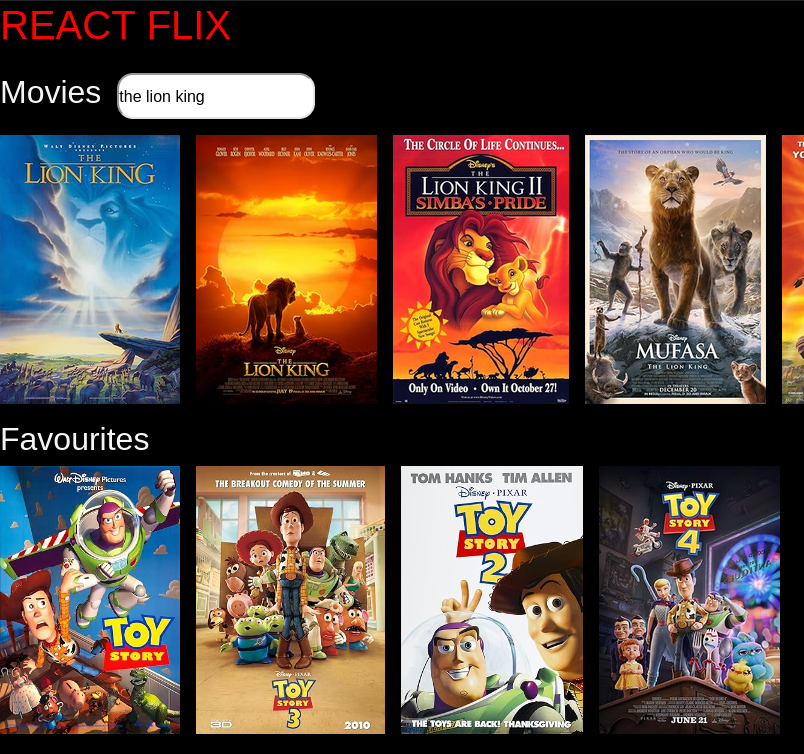

# 🎬 **Movie App** 🍿

A simple movie search application built using React and the [TMDB API](https://www.themoviedb.org/). This app allows users to search for movies, see movie posters and save favourites.

## 🌟 Features
- 🔍 **Search for movies** by title.
- 🎥 Display **movie posters** and **titles**.
- 📱 **Netflix Like design**.

## 🎬 Demo
[View live demo](https://movie-app-rose-five.vercel.app/) 

## 🛠️ Technologies Used
- **Frontend**: React.js, CSS
- **API**: [OMDB API](https://www.omdbapi.com/)
- **Deployment**:  Vercel

